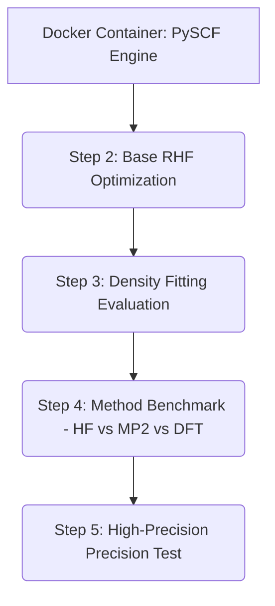

# 📊 Hands-On Lab Week 3 Results: Electronic-Structure Workflows

This report details the computational chemistry simulation workflows performed on a single Water ($H_2O$) molecule using the **PySCF** electronic structure package containerized via **Docker**.

---

## 🛠️ Computational Architecture Workflow

Below is the structured data generation pipeline utilized for this practical session:

---

## Density Fitting Comparison

Here is a comparison of the simulation results before and after the Density Fitting feature was enabled:

| Condition | Energy (Hartree) | Working Time (CPU Time) |
| :--- | :--- | :--- |
| Tanpa Density Fitting (RHF) | -75.9609751670 | 0.20 s |
| Pakai Density Fitting (DFRHF) | -75.9609192737 | 0.19 s |

* **Energy Shift:** 0.0000558933 Hartree

* Conclusion: Actually, Density Fitting is useful for speeding up the behind-the-scenes mathematical calculations. Perhaps because the water molecules ($H_2O$) being tested are very small, the difference in processing time isn’t very noticeable, even though Density Fitting is 0.01 seconds faster. Furthermore, we can see that the energy results are almost exactly the same and the difference only begins at the fifth decimal place. However, the results are consistent with energy theory, the use of Density Fitting will result in a higher calculated energy

## Computational Cost Comparison

The following is a comparison of the speed or computational cost of three different methods:

| Computational Method | Working Time (CPU Time) |
| :--- | :--- |
| Hartree-Fock (HF) | 0.16 s |
| Møller–Plesset Theory (MP2) | 0.15 s |
| Density Functional Theory (DFT) | 0.16 s |

* Conclusion: In theory, the MP2 method should be the most computationally complex compared to HF and DFT. However, on my laptop, their computation times are quite similar (ranging from 0.15 to 0.16 seconds). This is possibly because the water molecule has only 3 atoms and 10 electrons, so the system is too simple to put a significant strain on the laptop’s CPU, resulting in similar computation times.

## Tightened Convergence Tolerance

In this section, we tighten the tolerance limits and increase the grid level in the DFT (B3LYP) simulation to observe changes in the numerical values:

| Grid & Tolerance Settings | Energy Results (Hartree) |
| :--- | :--- |
| Standar (`conv_tol = 1e-09`, `grids.level = 3`) | -76.3581492541 |
| Tightened (`conv_tol = 1e-10`, `grids.level = 5`) | -76.3581493060 |

* Conclusion: There is a difference in the seventh decimal place, where calculations with a tighter tolerance generate a more negative energy value. This shift proves that increasing the grid level is equivalent to increasing the resolution of the calculation points around the molecule. This is consistent with a fundamental principle of computational chemistry, which states that more precise calculations will result in lower energy values because the system is able to capture electron interactions more accurately.