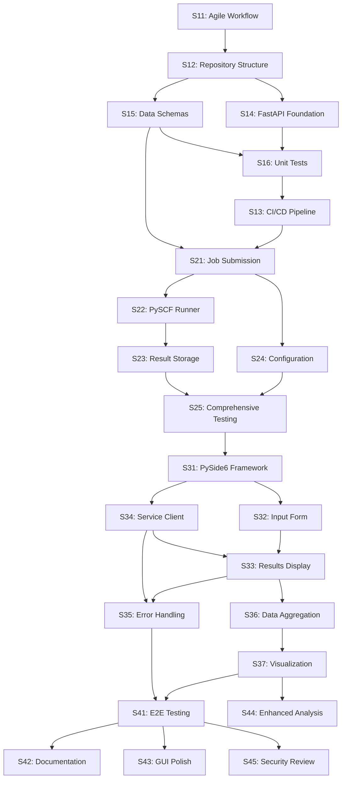

# Sprint 1 Implementation Strategies

This directory contains detailed implementation strategy documents for all Sprint 1 stories in the CompChem PySCF GUI project.

## Overview

**Sprint 1 Goal:** Establish project infrastructure, CI/CD pipeline, and core architecture foundation.
**Sprint 2 Goal:** Implement FastAPI service endpoints, PySCF integration, and job processing functionality.
**Sprint 3 Goal:** Develop PySide6 GUI application with visualization and data analysis capabilities.
**Sprint 4 Goal:** Complete final integration, polish user experience, comprehensive testing, and prepare for production delivery.

**Sprint 1 Duration:** 3 days  
**Sprint 1 Story Points:** 34  
**Sprint 1 Stories:** 6

**Sprint 2 Duration:** 4 days  
**Sprint 2 Story Points:** 42  
**Sprint 2 Stories:** 5

**Sprint 3 Duration:** 4 days  
**Sprint 3 Story Points:** 47  
**Sprint 3 Stories:** 7

**Sprint 4 Duration:** 3 days  
**Sprint 4 Story Points:** 28  
**Sprint 4 Stories:** 5

**Total Stories Documented:** 23

---

## Story Index

### Epic: Project Infrastructure Setup

| Story ID | Title | Owner | Story Points | Priority | Status |
|----------|-------|-------|--------------|----------|---------|
| [S11](./S11-implementation.md) | Set up Agile Workflow Infrastructure | DevOps Engineer | 5 | Critical | Planned |
| [S12](./S12-implementation.md) | Establish Repository Structure | Backend Developer | 3 | Critical | Planned |
| [S13](./S13-implementation.md) | Set up CI/CD Pipeline | DevOps Engineer | 8 | Critical | Planned |

### Epic: Service Architecture

| Story ID | Title | Owner | Story Points | Priority | Status |
|----------|-------|-------|--------------|----------|---------|
| [S14](./S14-implementation.md) | Create FastAPI Service Foundation | Backend Developer | 8 | High | Planned |
| [S15](./S15-implementation.md) | Define Data Schemas | Backend Developer | 5 | High | Planned |
| [S16](./S16-implementation.md) | Implement Basic Unit Tests | QA Engineer | 5 | High | Planned |

---

## Implementation Strategy Template

Each implementation strategy follows a standardized format:

1. **Objective** - Single, testable outcome
2. **Scope & Non-Goals** - Clear boundaries
3. **Requirements & Acceptance Criteria** - From sprint backlog
4. **Architecture & Data Impact** - Technical components
5. **Implementation Plan** - Step-by-step approach
6. **API/Schema Changes** - Interface definitions
7. **Test Plan** - Coverage and validation strategy
8. **Verification Checklist** - DoD mapping
9. **Risk, Mitigation, Rollback** - Risk management
10. **Dependencies & Sequencing** - Story relationships
11. **Telemetry & Observability** - Monitoring approach
12. **Docs & Change Management** - Documentation updates
13. **Work Items** - Branch, PR, and review details

### Epic: Service Implementation (Sprint 2)

| Story ID | Title | Owner | Story Points | Priority | Status |
|----------|-------|-------|--------------|----------|---------|
| [S21](./S21-implementation.md) | Implement Job Submission Endpoint | Backend Developer | 8 | Critical | Planned |
| [S22](./S22-implementation.md) | Implement PySCF Runner | Backend Developer | 13 | Critical | Planned |
| [S23](./S23-implementation.md) | Implement Result Storage and Retrieval | Backend Developer | 8 | Critical | Planned |
| [S24](./S24-implementation.md) | Add Service Configuration Management | DevOps Engineer | 5 | High | Planned |

### Epic: Service Testing & Quality (Sprint 2)

| Story ID | Title | Owner | Story Points | Priority | Status |
|----------|-------|-------|--------------|----------|---------|
| [S25](./S25-implementation.md) | Comprehensive Service Testing | QA Engineer | 8 | High | Planned |

### Epic: GUI Development (Sprint 3)

| Story ID | Title | Owner | Story Points | Priority | Status |
|----------|-------|-------|--------------|----------|---------|
| [S31](./S31-implementation.md) | Set up PySide6 Application Framework | Frontend Developer | 8 | Critical | Planned |
| [S32](./S32-implementation.md) | Create Input Form Components | Frontend Developer | 8 | Critical | Planned |
| [S33](./S33-implementation.md) | Implement Results Display | Frontend Developer | 8 | High | Planned |
| [S34](./S34-implementation.md) | Implement Service Client Integration | Backend Developer | 8 | Critical | Planned |
| [S35](./S35-implementation.md) | Implement Error Handling and User Feedback | Frontend Developer | 5 | High | Planned |

### Epic: Data Analysis Pipeline (Sprint 3)

| Story ID | Title | Owner | Story Points | Priority | Status |
|----------|-------|-------|--------------|----------|---------|
| [S36](./S36-implementation.md) | Implement Data Aggregation and Analysis Pipeline | Data Scientist | 5 | High | Planned |
| [S37](./S37-implementation.md) | Implement Visualization Generation | Frontend Developer | 5 | High | Planned |

### Epic: Final Integration & Testing (Sprint 4)

| Story ID | Title | Owner | Story Points | Priority | Status |
|----------|-------|-------|--------------|----------|---------|
| [S41](./S41-implementation.md) | End-to-End Integration Testing | QA Engineer | 8 | Critical | Planned |
| [S42](./S42-implementation.md) | Production Readiness & Documentation | Technical Writer | 6 | Critical | Planned |

### Epic: User Experience Polish (Sprint 4)

| Story ID | Title | Owner | Story Points | Priority | Status |
|----------|-------|-------|--------------|----------|---------|
| [S43](./S43-implementation.md) | GUI Polish and User Experience Improvements | Frontend Developer | 7 | High | Planned |
| [S44](./S44-implementation.md) | Enhanced Analysis and Visualization | Data Scientist | 5 | Medium | Planned |

### Epic: Security & Maintenance (Sprint 4)

| Story ID | Title | Owner | Story Points | Priority | Status |
|----------|-------|-------|--------------|----------|---------|
| [S45](./S45-implementation.md) | Security Review and Hardening | DevOps Engineer | 4 | High | Planned |

---

## Critical Path Dependencies

**Key Dependencies:**
- **Sprint 1:** S11 → S12 → (S14,S15) → S16 → S13
- **Sprint 2:** S13,S15 → S21 → S22 → S23 → S25 (with S24 parallel)
- **Sprint 3:** S25 → S31 → (S32,S34) → S33 → (S35,S36) → S37
- **Sprint 4:** S37,S35 → S41 → (S42,S43,S44,S45) parallel completion

---

## Quality Gates

### Sprint 1 Exit Criteria:
- [ ] All 6 stories completed per acceptance criteria
- [ ] CI pipeline functional with green tests
- [ ] Repository structure matches specification
- [ ] Basic service responds to health checks
- [ ] DoD and PR process established
- [ ] All implementation strategies reviewed and approved

### Sprint 2 Exit Criteria:
- [ ] All 5 stories completed per acceptance criteria
- [ ] All API endpoints functional per ICD specification
- [ ] PySCF calculations complete successfully in dryrun mode
- [ ] Results stored in proper JSON format
- [ ] Comprehensive test coverage achieved
- [ ] Performance meets timing requirements (CI ≤ 5min total)

### Sprint 3 Exit Criteria:
- [ ] All 7 stories completed per acceptance criteria
- [ ] PySide6 GUI application functional with complete workflow
- [ ] Service client integration working end-to-end
- [ ] Data aggregation and visualization pipeline complete
- [ ] Error handling provides comprehensive user feedback
- [ ] Performance meets usability requirements

### Sprint 4 Exit Criteria:
- [ ] All 5 stories completed per acceptance criteria
- [ ] End-to-end integration testing validates complete system
- [ ] Production documentation enables independent deployment
- [ ] User experience polish provides professional interface
- [ ] Security review identifies and addresses all critical issues
- [ ] System ready for educational environment deployment

### Definition of Done (Common to All Stories):
1. ✅ Code implemented per acceptance criteria
2. ✅ Unit tests written and passing
3. ✅ Code reviewed and approved
4. ✅ Integration tests passing (where applicable)
5. ✅ Documentation updated
6. ✅ Performance requirements met

---

## Sprint Metrics

**Story Point Distribution:**
- **Sprint 1 Infrastructure (S11-S13):** 16 points (47%)
- **Sprint 1 Service Foundation (S14-S16):** 18 points (53%)
- **Sprint 2 Core Implementation (S21-S24):** 34 points (81%)
- **Sprint 2 Testing & Quality (S25):** 8 points (19%)
- **Sprint 3 GUI Development (S31-S35):** 37 points (79%)
- **Sprint 3 Data Analysis (S36-S37):** 10 points (21%)
- **Sprint 4 Integration & Testing (S41-S42):** 14 points (50%)
- **Sprint 4 Polish & Security (S43-S45):** 16 points (50%)

**Risk Assessment:**
- **High Risk:** S13 (CI/CD setup), S22 (PySCF integration), S34 (service client), S37 (visualization), S41 (E2E testing)
- **Medium Risk:** S14 (Docker config), S16 (test env), S23 (file I/O), S25 (testing), S31 (PySide6 setup), S36 (data pipeline), S43 (UX polish), S45 (security)
- **Low Risk:** S11, S12, S15 (structure), S21, S24 (config), S32, S33, S35 (GUI components), S42 (documentation), S44 (enhanced analysis)

---

## Getting Started

1. **Review Dependencies:** Check the dependency graph before starting any story
2. **Read Implementation Strategy:** Each story has detailed implementation guidance
3. **Follow Work Items:** Use specified branch names and PR templates
4. **Track Progress:** Update story status in GitHub project board
5. **Validate DoD:** Use verification checklists before marking stories complete

---

## Questions and Issues

For questions about specific implementation strategies:
- Review the "Follow-ups" section in each strategy document
- Check for OPEN-QUESTION items that need resolution
- Consult with the assigned story owner
- Escalate blocking issues to Technical Lead

See [Sprint Backlog Master](../sprint-backlog-master.md) for complete project overview.
